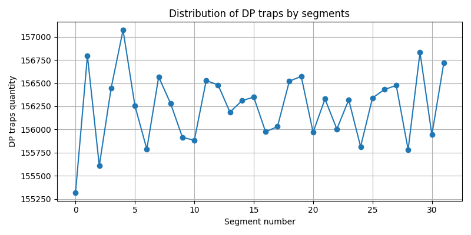

# 🦘 Pollard-Kangaroo Solver (Mark1)

**Mark1** is a high-performance, parallelized Pollard's Kangaroo algorithm implementation for solving ECDLP (Elliptic Curve Discrete Logarithm Problem) on the secp256k1 curve. It features wrap-aware kangaroos, configurable jump sizes, live statistics, loop detection, and restart counters.

# 🤝 Acknowledgements
Based on the original Pollard's Kangaroo algorithm
Uses SECP256K1 implementation from JeanLucPons/VanitySearch
Inspired by various cryptographic research papers

## 🔥 Key Features

- **Optimized AVX2 Implementation**: Leverages modern CPU instructions for maximum performance
- **Parallel Processing**: Utilizes OpenMP for multi-threaded execution
- **Smart Kangaroo Management**:
  - Configurable jump table size (`--k` parameter)
  - Wrap-around detection for out-of-range kangaroos
  - Brent's loop detection algorithm
  - Restart counters for stuck kangaroos
- **Efficient DP Storage**:
  - Compact representation of distinguished points
  - SIMD-accelerated Bloom filter for quick lookups
  - Configurable DP bits (`--dp_bits`)
- **Live Statistics**: Real-time monitoring of hops, speed, and restarts
- **Range Support**: Solves for arbitrary ranges (`--range` parameter)
- **Result Verification**: Automatically verifies found private keys

## Required Parameters:
**--range START:END**: Range to search (decimal or hex with 0x prefix)  
**--pubkey PUBKEY**: Target public key (compressed or uncompressed)  

## Optional Parameters:
**--dp_point N**: Number of distinguished points to generate (auto-calculated if omitted)  
**--dp_bits N**: Distinguished point mask bits (default: 12)  
**--k N**: Jump table size (default: range_bits/2)  
**--ram N**: RAM limit in GB (default: 16)  
**--save-dp**: Save distinguished points to DP.bin  
**--load-dp**: Load distinguished points from DP.bin. You can skip Phase1 

## 📊 Performance

Example performance on modern CPUs:

| CPU Model           | Threads | Speed (Hops/s) |
|---------------------|---------|----------------|
| Ryzen 9 7945HX      | 32      | ~160 MH/s      |
| Ryzen 7 5800H       | 16      | ~65 MH/s       |

## 🔷 Example Output
Below is an example of Mark1 in action, solving a Satoshi puzzle:  

**55 bits**  
```bash
./Mark1 --range 18014398509481983:36028797018963967  --pubkey 0385a30d8413af4f8f9e6312400f2d194fe14f02e719b24c3f83bf1fd233a8f963 --dp_point 500000 --dp_bits 10 --ram 32 

=========== Phase-0: RAM summary ===========
DP table : 26.1Mb  ( 500000 / 666667 slots, load 75.00% )
Bloom    : 977Kb
--------------------------------------------
Total    : 27.0Mb

========== Phase-1: Building traps =========
Unique traps: 500000/500000 (done)

=========== Phase-2: Kangaroos =============
Speed: 35.91 MH/s | Hops: 179568640 | Restart wild: 0 | Time: 0:0:5

============= Phase-3: Result ==============
Private key : 0x000000000000000000000000000000000000000000000000006ABE1F9B67E114
Found by thr: 17
Wild wraps  : 0  [no wrap]
Wild restart: 0
Total time  : 00:00:01.190
Private key : saved to FOUND.txt
```
**60 bits**  
```bash
./Mark1 --range 576460752303423487:1152921504606846975  --pubkey 0348e843dc5b1bd246e6309b4924b81543d02b16c8083df973a89ce2c7eb89a10d --dp_point 600000 --dp_bits 8 --ram 32 

=========== Phase-0: RAM summary ===========
DP table : 31.3Mb  ( 600000 / 800000 slots, load 75.00% )
Bloom    : 1.14Mb
--------------------------------------------
Total    : 32.4Mb

========== Phase-1: Building traps =========
Unique traps: 600000/600000 (done)

=========== Phase-2: Kangaroos =============
Speed: 126.51 MH/s | Hops: 632553472 | Restart wild: 0 | Time: 0:0:5

============= Phase-3: Result ==============
Private key : 0x0000000000000000000000000000000000000000000000000FC07A1825367BBE
Found by thr: 3
Wild wraps  : 0  [no wrap]
Wild restart: 0
Total time  : 00:00:04.096
Private key : saved to FOUND.txt
```
**75 bits**
```bash
./Mark1 --range 18889465931478580854783:37778931862957161709567  --pubkey 03726b574f193e374686d8e12bc6e4142adeb06770e0a2856f5e4ad89f66044755 --dp_point 200000000 --dp_bits 8 --ram 32

=========== Phase-0: RAM summary ===========
DP table : 10.2Gb  ( 200000000 / 268435456 slots, load 74.51% )
Bloom    : 381Mb
--------------------------------------------
Total    : 10.6Gb

========== Phase-1: Building traps =========
Unique traps: 200000000/200000000 (done)

=========== Phase-2: Kangaroos =============
Speed: 109.95 MH/s | Hops: 133433945344 | Restart wild: 0 | Time: 0:14:05

============= Phase-3: Result ==============
Private key : 0x0000000000000000000000000000000000000000000004C5CE114686A1336E07
Found by thread: 12
Wild wraps  : 0  [no wrap]
Wild restart: 0
Total time  : 00:14:06.325
Private key saved to FOUND.txt
```
**80 bits**  
```bash
./Mark1 --range 604462909807314587353087:1208925819614629174706175  --pubkey 037e1238f7b1ce757df94faa9a2eb261bf0aeb9f84dbf81212104e78931c2a19dc --dp_point 500000000 --dp_bits 12 --ram 32

=========== Phase-0: RAM summary ===========
DP table : 25.5Gb  ( 500000000 / 666666667 slots, load 75.00% )
Bloom    : 954Mb
--------------------------------------------
Total    : 26.4Gb

========== Phase-1: Building traps =========
Unique traps: 500000000/500000000 (done)

=========== Phase-2: Kangaroos =============
Speed: 103.94 MH/s | Hops: 364681496320 | Restart wild: 0 | Time: 0:38:10

============= Phase-3: Result ==============
Private key : 0x00000000000000000000000000000000000000000000EA1A5C66DCC11B5AD180
Found by thread: 6
Wild wraps  : 0  [no wrap]
Wild restart: 0
Private key saved to FOUND.txt
```

## 🔦 DP quality

The example is given for a range of 55 bits, 32 processor threads and 500000 traps.



## 🛠️ Building

Requirements:
- Ubuntu Linux or WSL2 for Windows  
- GCC 9+ or Clang 10+
- OpenMP support
- AVX2 capable CPU

```bash
git clone https://github.com/yourusername/Mark1.git
cd Mark1
g++ Mark1.cpp Int.cpp SECP256K1.cpp Point.cpp Random.cpp IntMod.cpp IntGroup.cpp Timer.cpp -O3 -march=native -funroll-loops -ftree-vectorize -fstrict-aliasing -fno-semantic-interposition -fvect-cost-model=unlimited -fno-trapping-math -fipa-ra -fipa-modref -flto -fassociative-math -fopenmp -mavx2 -mbmi2 -madx -std=c++17 -fopenmp -pthread -o Mark1
```

## 🚧**VERSIONS**
**V1.3**: Full SSD rework: double hashing, MAX_LOAD=0.5, bloom filter size increasing (10 bit), batched inserting/checking, MADV_SEQUENTIAL. Thanks OpenAI for ChatGPT helping to solve these problems. This is amazing!  
**V1.2**: SSD rework. Dp table storing on SSD, instead of RAM. A few security updates and speed increasing.  
**V1.1**: Added save and load distinguished points (DP) from file (DP.bin). This feature was coded by NoMachine.  
**V1.0**: Release

## ✌️TIPS
BTC: bc1qtq4y9l9ajeyxq05ynq09z8p52xdmk4hqky9c8n
